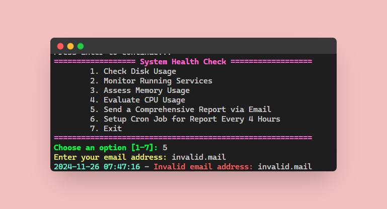
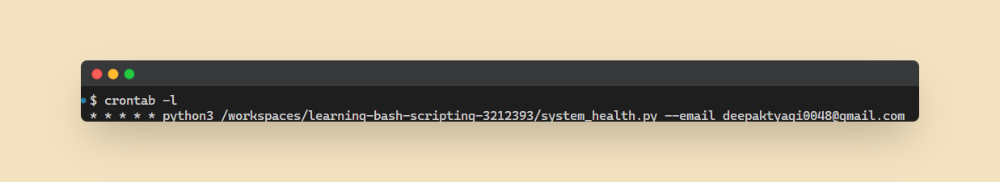

---

# System Health Monitoring Script

## Overview

This project provides a Python script that helps monitor the health of your system by checking key resources like disk usage, memory, CPU, and running services. It also allows you to generate a comprehensive system health report and send it via email. The script includes an interactive menu for easy operation, and it can be configured to run periodically using a cron job.

### Features
- **Disk Usage**: Checks the system's disk space usage and logs it.
- **Service Monitoring**: Monitors and lists the currently running services.
- **Memory Usage**: Assesses the system's memory usage.
- **CPU Usage**: Evaluates CPU usage and displays relevant information.
- **Email Reports**: Sends a comprehensive health report to a specified email address.
- **Cron Job**: Sets up a cron job to run the script periodically (every 4 hour).
- **Error Handling**: Gracefully handles the invalid input emails and input selection

   

## Files

### Python Script (`system_health.py`)
- This script handles system health checks, logs the results, and sends the reports via email.
- It includes a function to send the health report to an email address in HTML format for better readability.
- The script can be run interactively via a menu or with a specified `--email` argument to send an immediate report.
- It also supports setting up a cron job to send reports at regular intervals.

### Bash Script (`system_health.sh`)
- An optional Bash script version of this tool that works similarly to the Python version.
- You can use either the Python script or the Bash script depending on your preference.

## How It Works

### 1. **System Health Check**
   The script provides several options in a simple menu:
   - **Check Disk Usage**: Displays the system’s disk space usage.
   - **Monitor Running Services**: Lists all currently running services.
   - **Assess Memory Usage**: Shows memory usage stats.
   - **Evaluate CPU Usage**: Displays CPU usage information.

### 2. **Sending Reports**
   - The script can send the system health report via email. The report includes the system's current disk, memory, and CPU stats.
   - The email is formatted in HTML for better readability.
   - You can specify the recipient's email address directly when prompted.

### 3. **Setting Up a Cron Job**
   - You can set up a cron job to automatically send health reports every 4 hours (or customize the schedule).
   - The cron job runs the script in the background, sending reports to the specified email without any manual intervention.

### 4. **Logging**
   - All actions are logged to `/tmp/system_health.log` for future reference.
   - Logs include timestamps and are color-coded for easy reading.

## Installation

1. Clone or download the repository:
   ```bash
   git clone https://github.com/deeepak-tyagii/devops-sre-daily-challenge.git
   ```

2. Change into Day 1 directory:
   ```bash
   cd Day 1 - System Health Report Generator
   ```

3. Install necessary dependencies for Python:
   ```bash
   pip install -r requirements.txt
   ```

4. Run the Python script:
   ```bash
   python3 system_health.py
   ```

5. Alternatively, if you're using the Bash script, execute:
   ```bash
   ./system_health.sh
   ```

## Usage

1. Run the script and choose from the menu options. 

2. Select the option 1 to view the disk usage.
3. Select the option 2 to monitor running services.
4. Select the option 3 to access memory usage.
5. Select the option 4 to evaluate CPU usage.
6. To send a report immediately, choose the option 5 to send via email. First let's enter an invalid email to see proper error message.
7. Now, enter a valid email address.
8. Validate that we have received the email. 
10. To set up a cron job, enter the email address where you want to receive periodic reports. 
11. Now, re-enter the email address to see "Cron job already exists" message. 
12. Enter any invalid option/number to view error message. 
13. Exit the script after completing the tasks.

### Command-Line Options
- `--email <email>`: Send a report immediately to the specified email address.

## Example Usage:

- **Send a report via email**:
   ```bash
   python3 system_health.py --email your_email@example.com
   ```

- **Set up a cron job**:
   Choose option `6` in the interactive menu and provide an email address.

## Notes

- Make sure to replace the `sender_email` and `sender_password` variables in the Python script with your email credentials for sending reports.
- The cron job is set to run every minute by default, but you can modify the interval as needed.

## License

This project is licensed under the MIT License - see the [LICENSE](LICENSE) file for details.

---
